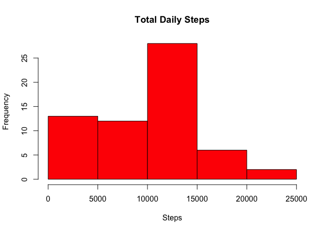
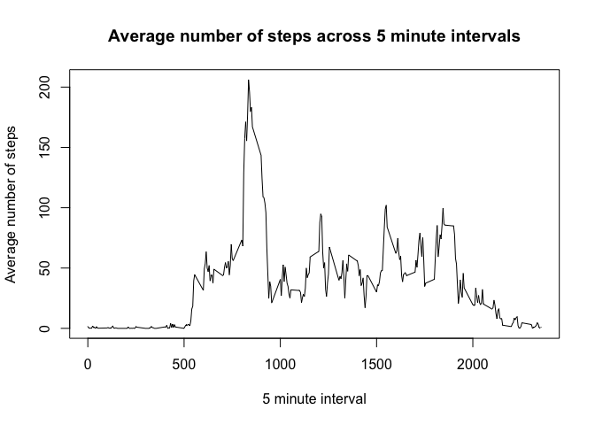
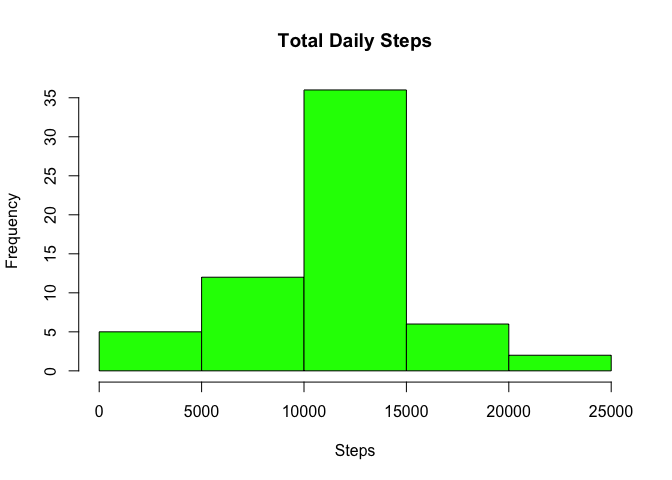
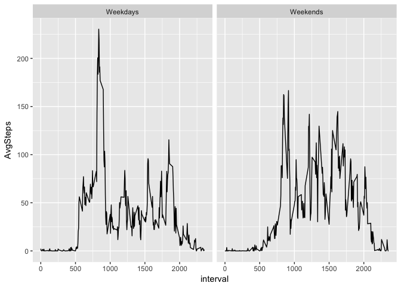

# Reproducible Research: Peer Assessment 1


## Loading and preprocessing the data

```r
setwd("/Users/Andrew/Library/Mobile Documents/com~apple~CloudDocs/Reproducible research/Assignment 1/RepData_PeerAssessment1")
library(dplyr)
```

```
## 
## Attaching package: 'dplyr'
```

```
## The following objects are masked from 'package:stats':
## 
##     filter, lag
```

```
## The following objects are masked from 'package:base':
## 
##     intersect, setdiff, setequal, union
```

```r
library(reshape2)
library(ggplot2)
```

```r
activity <- read.csv("activity.csv")
activity$date <- as.Date(as.character(activity$date),format = "%Y-%m-%d")
```
## What is mean total number of steps taken per day?
1. Histogram of total steps per day

```r
steps <- group_by(activity,date) %>% summarise(TotalSteps=sum(steps,na.rm=TRUE))
hist(steps$TotalSteps,main = "Total Daily Steps",xlab = "Steps",col = "red")
```

<!-- -->

The mean number of steps per day is:

```r
mean(steps$TotalSteps)
```

```
## [1] 9354.23
```

The median number of steps per day is:

```r
median(steps$TotalSteps)
```

```
## [1] 10395
```

## What is the average daily activity pattern?
Plot of averge number of steps by 5 minute intervals

```r
daily <- group_by(activity,interval) %>% summarise(AvgSteps=mean(steps,na.rm=TRUE))
plot(daily$interval,daily$AvgSteps,type = "l",main = "Average number of steps across 5 minute intervals",xlab = "5 minute interval",ylab = "Average number of steps")
```

<!-- -->

The 5 minute interval with the highest number of steps, on average is:

```r
daily$interval[which.max(daily$AvgSteps)]
```

```
## [1] 835
```

## Imputing missing values
Total number of missing values:

```r
sum(is.na(activity$steps))
```

```
## [1] 2304
```

Impute missing values in a new dataset by replacing missing steps with the average for that interval (missing values removed).

```r
activity2 <- activity
for(i in 1:length(activity2$steps)) {
        if(is.na(activity2$steps[i])) {
                activity2$steps[i]=daily$AvgSteps[activity2$interval[i]==daily$interval]
        }
}
sum(is.na(activity2$steps))
```

```
## [1] 0
```

Create a histogrm of the new dataset with imputed values

```r
steps2 <- group_by(activity2,date) %>% summarise(TotalSteps=sum(steps))
hist(steps2$TotalSteps,main = "Total Daily Steps",xlab = "Steps",col = "green")
```

<!-- -->

The mean number of steps per day for the new dataset is:

```r
mean(steps2$TotalSteps)
```

```
## [1] 10766.19
```

The median number of steps per day for the new dataset is:

```r
median(steps2$TotalSteps)
```

```
## [1] 10766.19
```


## Are there differences in activity patterns between weekdays and weekends?
Create a factor variable indicating whether a day is a weekday or weekend

```r
for(j in 1:length(activity2$steps)) {
        if(weekdays(activity2$date[j])=="Saturday" | weekdays(activity2$date[j])=="Sunday") {
                activity2$dayInd[j] <- "Weekend"
        } else activity2$dayInd[j] <- "Weekday"
}
activity2$dayInd <- as.factor(activity2$dayInd)
```

Create a panel plot of the average number of steps on weekdays and weekends

```r
activityWd <- activity2[activity2$dayInd=="Weekday",]
dailyWd <- group_by(activityWd,interval) %>% summarise(AvgSteps=mean(steps))

activityWe <- activity2[activity2$dayInd=="Weekend",]
dailyWe <- group_by(activityWe,interval) %>% summarise(AvgSteps=mean(steps))

activity3 <- merge(dailyWd,dailyWe,by="interval")
names(activity3) <- c("interval","Weekdays","Weekends")

activity4 <- cbind(activity3$interval,melt(activity3[,2:3]))
```

```
## No id variables; using all as measure variables
```

```r
names(activity4) <- c("interval","dayInd","AvgSteps")
activity4$dayInd <- as.factor(activity4$dayInd)

qplot(interval,AvgSteps,data=activity4,facets = .~dayInd,geom = c("line"))
```

<!-- -->
